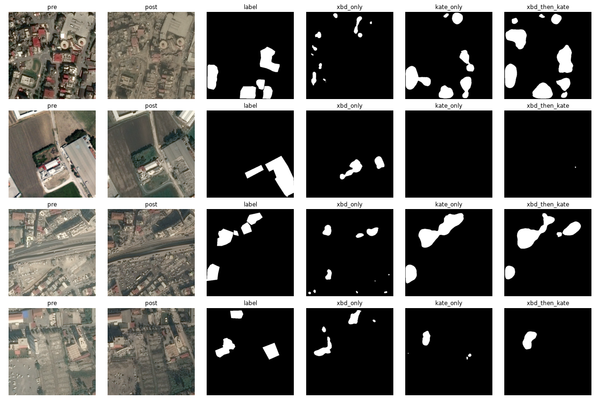
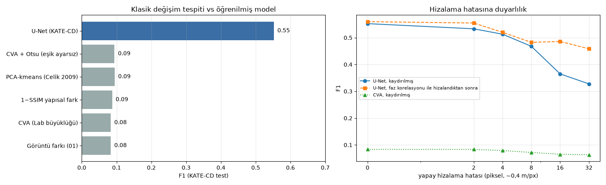
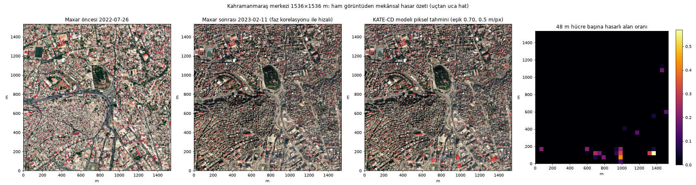
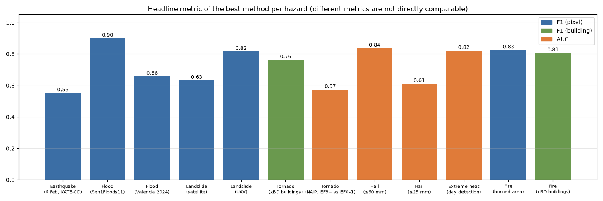
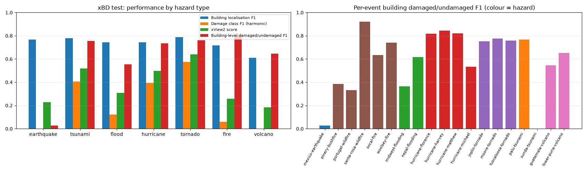

# DamageLens

**Disaster Damage Assessment from Satellite and Aerial Images** — öncesi/sonrası uydu ve hava görüntülerinden hasar tespiti.

CENG391 Introduction to Image Understanding, 2026 Fall, term project **#30**, group G15 (3 kişi).

> Develop a change/damage assessment system using pre-event and post-event aerial/satellite images. Align image pairs, identify changed regions, classify or segment damaged structures/areas, and summarize damage spatially. Compare simple image-difference/feature baselines with a learned change-detection approach.

Kapsam afet türüne bağlı değil: öncesi/sonrası görüntüden hasarlı **yapıları** (çok sınıflı bina hasarı) ve hasarlı **alanları** (ikili maske: yanık, taşkın, tarım hasarı) çıkarmak. Ana vaka **6 Şubat 2023 Kahramanmaraş depremleri**; aynı hat hortum, yangın, sel ve dolu üzerinde de denendi (`experiments/multi-hazard/`).

## Durum

Fizibilite tamamlandı: ödevin her adımı açık veriyle uçtan uca çalıştırıldı.

| Ödev adımı | Kodda | Şu anki sonuç |
|---|---|---|
| Öncesi/sonrası görüntü | `damagelens.data` (`kate`, `xbd`, `maxar`) | KATE-CD (Maxar + Pleiades, 0,3–0,5 m), xBD, ham Maxar Open Data, NAIP uçak görüntüsü |
| Görüntü çiftlerini hizalama | `damagelens.align` (faz korelasyonu, ORB + RANSAC) | Ham Maxar çiftlerinde medyan 12–16 px (~6–8 m) kayma ölçüldü |
| Değişen bölgeleri bulma, hasarı segmentleme | `damagelens.models`, `damagelens.train` | KATE-CD test F1 **0.55**; xBD 5 sınıf xView2 skoru **0.62** |
| Mekânsal özet | `damagelens.summarize`, `app/demo.py` | Kahramanmaraş merkezi 1,5 km², 48 m hücre ısı haritası |
| Baseline vs öğrenilmiş model | `damagelens.baselines`, `damagelens.evaluate` | 5 klasik yöntem F1 0.08–0.09, U-Net 0.55 |





### 6 Şubat — KATE-CD test (38 kare, piksel bazlı)
| Yöntem | F1 | IoU |
|---|---|---|
| Görüntü farkı (Lab + histogram eşleme) | 0.083 | 0.043 |
| CVA / 1−SSIM / PCA-kmeans / CVA+Otsu | 0.083–0.094 | 0.043–0.050 |
| U-Net, xBD ile eğitilmiş, Türkiye'ye doğrudan | 0.108 | 0.057 |
| U-Net, xBD ön eğitim + KATE-CD ince ayar | 0.500 | 0.333 |
| U-Net, sadece KATE-CD | 0.552 | 0.382 |
| **U-Net, KATE-CD + ±16 px kaydırma + 200 hasarsız negatif** (`--shift-px 16 --negatives 200`) | **0.579** | **0.407** |

Hizalama hatasına dayanıklılık (öncesi görüntü yapay kaydırıldı, hizalama yapmadan):

| kayma (px) | 0 | 8 | 16 | 32 |
|---|---|---|---|---|
| U-Net, sadece KATE-CD | 0.552 | 0.468 | 0.365 | 0.328 |
| U-Net, kaydırma + negatifler | 0.579 | 0.582 | 0.554 | 0.488 |

### Diğer afet türleri (özet)
Ayrıntılı raporlar (her afet için yöntem, tablolar, grafikler, rastgele vakalar, sınırlar): [docs/disaster-report/](docs/disaster-report/README.md). Tek sayfalık sürüm: `docs/disaster-report/index.html` (yerelde tarayıcıda açılır).



| Afet | Veri | Ana sonuç |
|---|---|---|
| Sel | Sen1Floods11 (11 ülke), Valencia DANA 2024 vs Copernicus EMS | IoU 0.82; Valencia F1 0.66 |
| Heyelan | Landslide4Sense (uydu), İHA seti | F1 0.63 / 0.82 |
| Hortum | xBD; Rolling Fork 2023 NAIP uçak görüntüsü vs NWS EF noktaları | bina F1 0.77; uçak görüntüsünde AUC 0.57 |
| Dolu | Sentinel-2 ΔNDVI vs NOAA MESH, Nebraska 2022 | ≥60 mm AUC 0.84, ≥25 mm ≈0.6 |
| Aşırı sıcak | MODIS LST vs istasyon, 10 şehir, yaz 2023 | r 0.65, gün tespiti AUC 0.82 |
| Yangın | Sentinel-2 dNBR vs NIFC/EFFIS sınırları; xBD | IoU 0.54–0.86; bina F1 0.79 |



## Kurulum

```bash
uv venv --python 3.12 .venv && source .venv/bin/activate
uv pip install -r requirements.txt -e ".[dev]"
./download_data.sh kate        # ~450 MB, ana deney için yeterli
./download_data.sh maxar       # ham Maxar sahneleri için STAC indeksi (görüntü anında okunur)
pytest                         # 10 hızlı test, veri gerekmez
```

Diğer setler: `./download_data.sh xbd` (~24 GB), `flood`, `landslide`, `valencia`, `all`. Hepsi `data/` altına iner.

## Çalıştırma

```bash
damagelens-train --name kate_base                                     # 6 kanallı U-Net, KATE-CD (~25 dk, M4)
damagelens-train --name kate_robust --shift-px 16 --negatives 200      # kaydırma augmentation'ı + hasarsız negatifler
damagelens-eval  --model runs/kate_base/model.pt --shifts 0 8 16 32 --register
damagelens-eval  --baselines                                          # görüntü farkı, CVA, 1−SSIM, PCA-kmeans
python app/demo.py --model runs/kate_base/model.pt                    # ham Maxar → hizalama → model → hasar haritası
```

### Elle etiketleme (ham Maxar)

```bash
damagelens-label serve kahramanmaras-center     # http://127.0.0.1:8765 — eksik karoları manifestten üretir (~1 dk)
damagelens-label status                          # ilerleme
damagelens-label prepare antakya --lon 36.16 --lat 36.21 --side-m 2048   # yeni alan
```

- Öncesi ve sonrası yan yana; iki panelden birine tıklayarak poligon çizin, Enter ile kapatın. Sınıflar: `1` hasarlı, `2` yıkık, `3` hasarsız bina.
- `B` basılıyken sonrası panelinde öncesi görünür (değişimi görmek için). `V` karoyu bitirir, `S` kullanılamaz karoyu atlar, `T` sıradaki boş karo.
- Her değişiklik otomatik olarak `labels/<alan>/annotations/<karo>.json` dosyasına kaydedilir; bunlar git'e girer. Görüntü karoları girmez, manifestteki tarihlerden aynen yeniden üretilir.
- Üç kişi aynı alanı paylaşırken üstteki "pay" menüsünden 1/3, 2/3 veya 3/3'ü seçin; karolar çakışmaz.
- Eğitimde kullanmak için: `damagelens.label.load_labeled("kahramanmaras-center")` (KATE-CD biçimi: hasarlı + yıkık = 1). Harita için: `damagelens-label export <alan>` → `labels.geojson`.

Çıktılar `runs/<ad>/` altına yazılır (`model.pt` + eşik ve metrikleri içeren `model.json`). `app/demo.py` varsayılan olarak Kahramanmaraş merkezini kullanır; `--lon --lat --side-m` ile başka bir alan seçilebilir.

## Repo yapısı

```
src/damagelens/            asıl sistem
  data/                    KATE-CD, xBD, Maxar Open Data okuyucuları, karolama
  align/                   faz korelasyonu, ORB + RANSAC afin hizalama
  baselines/               görüntü farkı, CVA, 1−SSIM, PCA-kmeans; dNBR, NDVI, NDWI farkları
  models/                  6 kanallı U-Net (öncesi + sonrası RGB)
  augment.py               çevirme/döndürme, öncesi görüntüye rastgele kaydırma
  train.py, evaluate.py    CLI: damagelens-train, damagelens-eval
  summarize.py             karo karo hizala + tahmin et, hücre bazlı hasar özeti
  metrics.py               piksel F1/IoU, xView2 skoru, bina bazlı karışıklık matrisi
  label/                   elle etiketleme: karo hazırlama, yerel web arayüzü, etiket → maske/GeoJSON
app/demo.py                uçtan uca demo, ham Maxar sahnesi
labels/<alan>/             etiket manifesti ve poligonlar (git'te), karolar (git dışı)
tests/                     hızlı birim testleri
experiments/feasibility/   fizibilite betikleri (01–05), sayılar bunlardan
experiments/multi-hazard/  xBD 5 sınıf model, deprem dışı afet deneyleri, rapor üreticileri
docs/                      README grafikleri, afet raporları
download_data.sh           veri indirme
```
`data/`, `runs/`, `outputs/` klasörleri ve model ağırlıkları git'e girmez. `experiments/` donmuş deney kodudur; yeni iş `src/damagelens/` içinde yapılır.

## Dikkat edilmesi gerekenler

- **Etiketli testteki başarı ham sahneye taşınmıyor.** KATE-CD'de F1 0.55–0.58 alan modeller, ham Maxar görüntüsünde ağır hasarlı Kahramanmaraş merkezinde piksellerin yalnızca %0,6'sını (kaydırma + negatif modeli %0,09) hasarlı buluyor; eşik 0,3'e indirilse bile %1'in altında. Sorun eşik veya hizalama değil, alan farkı (farklı sahne seçimi, mevsim, işleme). Projenin asıl problemi bu ve çözümü ham Maxar'dan biraz etiketli veriyle ince ayar.
- **KATE-CD'nin her karesinde hasar var.** Model hiç hasarsız sahne görmedi, yanlış alarm oranı ölçülemiyor. Eğitime hasarsız negatifler eklenmeli.
- **KATE-CD koordinatsız**, mekânsal özetin sayısal doğrulaması için koordinatlı bir yer gerçeği lazım. Türkiye için bina bazlı başka açık bir set bulamadık: HOT OSM dosyası boş çıktı, Copernicus EMS EMSR648 giriş istiyor.
- **Mevsim, bakış açısı, kar ve bulut:** öncesi görüntüler yaz 2022, sonrası Şubat 2023. Kar ve bulut her iki modelde sahte hasar üretiyor. Mümkünse Aralık 2022 ve Ocak 2023 öncesi kareleri kullanın.
- **Hizalama:** 16 px kayma F1'i 0.55'ten 0.36'ya düşürüyor. Faz korelasyonu 0.49'a geri getiriyor; yüksek binalarda parallaks yüzünden tek bir kaydırma yetmiyor.
- **Başka afetlerden öğrenme taşınmıyor:** xBD'den Türkiye'ye doğrudan uygulama F1 0.11, xBD ön eğitimi ince ayarda da fayda vermedi.
- **Test seti küçük (38 kare):** sonuçları 3 tekrar ya da k-fold ile, ortalama ± standart sapma olarak verin.
- **Lisanslar:** xBD CC BY-NC-SA 4.0, Maxar Open Data CC BY-NC 4.0, ikisi de yalnız ticari olmayan kullanım için. KATE-CD'nin lisansı belirtilmemiş, yazarlara sorulmalı.

## Yapılacaklar

İşler issue olarak açık ve [DamageLens proje panosunda](https://github.com/orgs/Ceng391-Project/projects/1); her issue'nun bağlı bir `feat/<no>-<ad>` branch'i var. Rol etiketleri: **rol: A veri-hizalama**, **rol: B model**, **rol: C değerlendirme**.

- Öncelikli: #1 etiketleme aracı, #2 ham Maxar etiket seti, #3 ince ayar ve ham sahne değerlendirmesi
- A: #4 KATE-CD lisansı, #5 ORB vs faz korelasyonu, #6 kar/bulut maskesi, #7 gerçek negatifler
- B: #8 renk/gölge augmentation'ı, #9 Siamese model, #10 tam çözünürlüklü xBD + focal loss
- C: #11 seed / k-fold, #12 mahalle düzeyinde özet + harita, #13 final rapor ve sunum

## Veri kaynakları

- KATE-CD: https://huggingface.co/datasets/CSCRS/kate-cd (ITÜ CSCRS)
- xBD / xView2: https://xview2.org, mirror https://huggingface.co/datasets/hannan022/xview2-xbd
- Maxar Open Data Program: https://maxar-opendata.s3.amazonaws.com/events/catalog.json
- Sen1Floods11, Landslide4Sense, İHA heyelan seti, Copernicus EMS EMSR773, NOAA MRMS/SPC/NWS DAT, MODIS LST, Meteostat, NIFC, EFFIS: ayrıntılar `experiments/multi-hazard/` betiklerinde
