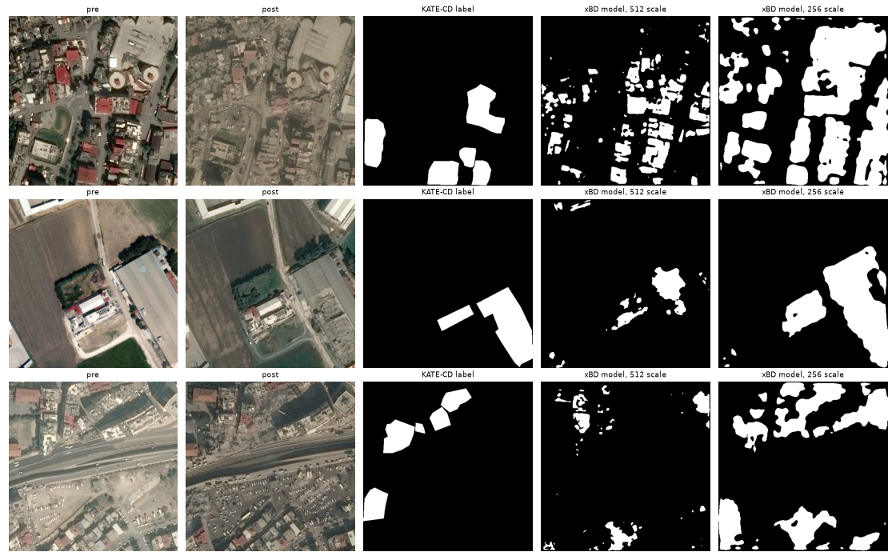
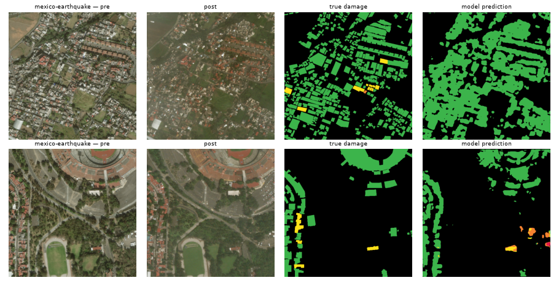
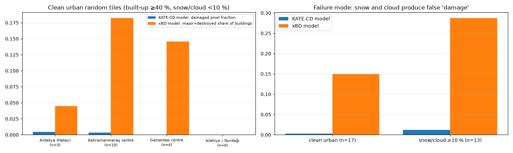
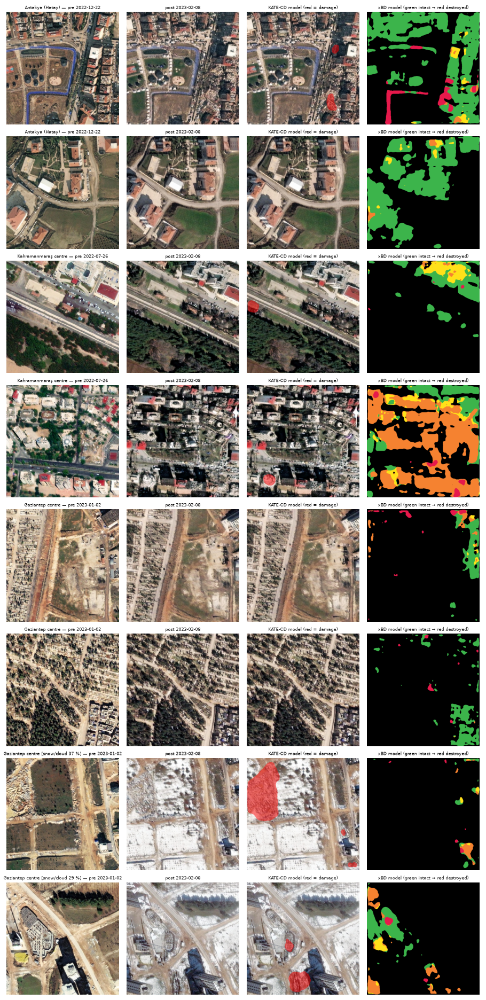

# Earthquake — 6 February 2023 Kahramanmaraş and the xBD earthquakes

## Summary
- **6 February (KATE-CD, Maxar + Pleiades, 0.3–0.5 m — Google-Earth-class imagery):** a model trained on Türkiye data reaches **F1 0.55** (IoU 0.38) on the test split; plain image differencing gets 0.08.
- **Learning from other earthquakes does not transfer to Türkiye:** the 5-class model trained on xBD (Mexico 2017, Palu 2018 and other disasters) scores **F1 0.14** on 6 February without fine-tuning.
- **Earthquake/tsunami events inside xBD:** building localisation F1 0.77 for the Mexico earthquake, but only 0.9% of its buildings are damaged, so the damage classes are very sparse. Palu tsunami damaged/undamaged building F1 0.77.
- **Random raw Maxar tiles (Antakya, Kahramanmaraş, Gaziantep, İslahiye/Nurdağı):** qualitative, no ground truth. Two findings: (1) snow and cloud in the February images raise false damage in both models; (2) on clean urban tiles the two models disagree a lot (the KATE model flags ~0.3% of pixels, the xBD model ~15% of buildings). The KATE model flags almost nothing even in heavily damaged Antakya, so its F1 on the labelled test split does not carry over to new scenes (every KATE-CD training tile contains damage and the model runs with a high threshold).

## Data and ground truth
| set | platform | resolution | ground truth |
|---|---|---|---|
| KATE-CD (HF `CSCRS/kate-cd`) | satellite: Maxar Open Data + Airbus Pleiades | 0.3–0.5 m | hand-drawn damaged-building polygons (486 pairs, 7 provinces) |
| xBD: mexico-earthquake, palu-tsunami, sunda-tsunami | satellite: Maxar | ~0.5 m (~1 m in the model) | building polygons + 4 damage levels |
| Maxar Open Data `Kahramanmaras-turkey-earthquake-23` | satellite: Maxar (WorldView/GeoEye) | ~0.3–0.5 m | none (qualitative test) |

> Google Earth imagery cannot be downloaded programmatically under its terms of use; much of the post-disaster very-high-resolution imagery shown in Google Earth comes from Maxar. Maxar Open Data of the same class is used here.

## Results — 6 February (KATE-CD test, 38 tiles, pixel level)
| method | precision | recall | F1 | IoU |
|---|---|---|---|---|
| Image difference (Lab + histogram matching) | 0.045 | 0.502 | 0.083 | 0.043 |
| U-Net (binary), xBD only (4 shards) → zero-shot | 0.096 | 0.130 | 0.110 | 0.058 |
| U-Net 5-class, full xBD → zero-shot, 512 scale | 0.080 | 0.154 | 0.105 | 0.056 |
| U-Net 5-class, full xBD → zero-shot, 256 scale (resolution matched) | 0.082 | 0.473 | 0.139 | 0.075 |
| U-Net, KATE-CD only (404 training tiles) | 0.624 | 0.496 | 0.552 | 0.382 |
| U-Net, xBD pretraining + KATE-CD fine-tuning | 0.571 | 0.444 | 0.500 | 0.333 |

*KATE-CD test: pre, post, label and three models*

*The xBD-trained 5-class model applied directly to 6 February*

## Results — earthquake / tsunami events in xBD
**Model:** 6-channel (pre + post RGB) U-Net / ResNet18, 5 classes (background, no damage, minor, major, destroyed). Trained on ≤250 images per event from xBD train + tier3 (3304 images), downsampled 1024 → 512 (~1 m/px), 12 epochs; best validation xView2 score 0.590. Test: xBD test split + a held-out 20 % of the tier3 events (1313 images). *Damage class F1* is the harmonic mean over the four damage classes (xView2 definition); *building* metrics use connected building components.

| event | buildings | building localisation F1 | damage class F1 | damaged/undamaged F1 (building) | destroyed recall | true damaged share |
|---|---|---|---|---|---|---|
| mexico-earthquake | 4745 | 0.766 | 0.000 | 0.027 | 0.000 | 0.009 |
| palu-tsunami | 3649 | 0.785 | 0.410 | 0.767 | 0.773 | 0.168 |
| sunda-tsunami | 1231 | 0.759 | 0.000 | 0.000 | 0.000 | 0.012 |
| **earthquake (all)** | 4745 | 0.766 | 0.000 | 0.027 | 0.000 | 0.009 |
| **tsunami (all)** | 4880 | 0.780 | 0.407 | 0.754 | 0.755 | 0.128 |

*Random xBD Mexico-earthquake test tiles*

## Random cases — Maxar Open Data, 6 February (Google-Earth-class)
Random 256 m × 256 m tiles (0.5 m/px) per city, with the latest pre-event and the first post-event Maxar acquisition. Tiles are split with WorldCover into *clean urban* (built-up ≥40 %, snow/cloud <10 %) and *other* (rural, snowy or cloudy — some February 2023 images have snow and cloud).
| city | clean urban tiles | KATE model: damaged pixels | xBD model: major+destroyed building share | other tiles | KATE (other) | xBD (other) |
|---|---|---|---|---|---|---|
| Antakya (Hatay) | 3 | 0.005 | 0.045 | 10 | 0.002 | 0.189 |
| Kahramanmaraş centre | 10 | 0.003 | 0.182 | 3 | 0.058 | 0.168 |
| Gaziantep centre | 4 | 0.000 | 0.146 | 12 | 0.013 | 0.322 |
| İslahiye / Nurdağı | 0 | – | – | 16 | 0.015 | 0.118 |

**Failure mode:** on the 13 tiles with ≥10 % snow/cloud the mean damage estimate is 0.012 (KATE model) and 0.29 (xBD model), against 0.003 and 0.15 on the 17 clean urban tiles. Snow inflates the pre/post difference and is read as damage, so operational use needs a snow/cloud mask.

*Mean prediction per city*

*Two clean urban tiles per city with the highest KATE prediction, plus two snowy/cloudy tiles*

## Limitations
- The KATE-CD test split has 38 tiles and one seed, so numbers can move by a few points. Every KATE-CD tile contains damage, so the false-alarm rate is only partly measurable.
- xBD images were downsampled 2× (~1 m/px); building and damage scores would be higher at native resolution.
- The random Maxar tiles have no ground truth, and pre/post images differ in viewing angle and season — false alarms must be checked by eye.

## Sources
- KATE-CD: https://huggingface.co/datasets/CSCRS/kate-cd (ITÜ CSCRS)
- xBD / xView2 (Gupta et al., 2019), Maxar Open Data imagery, CC BY-NC-SA 4.0 — HF mirror `hannan022/xview2-xbd`
- Maxar Open Data Program: https://maxar-opendata.s3.amazonaws.com/events/catalog.json
