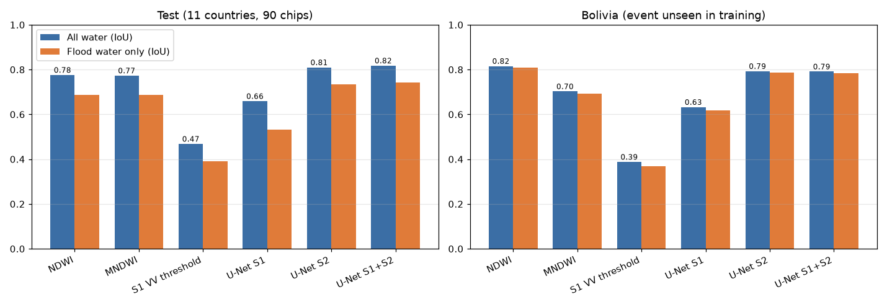
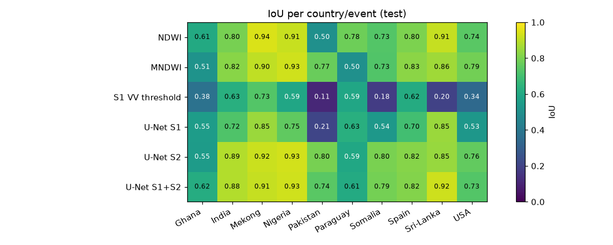
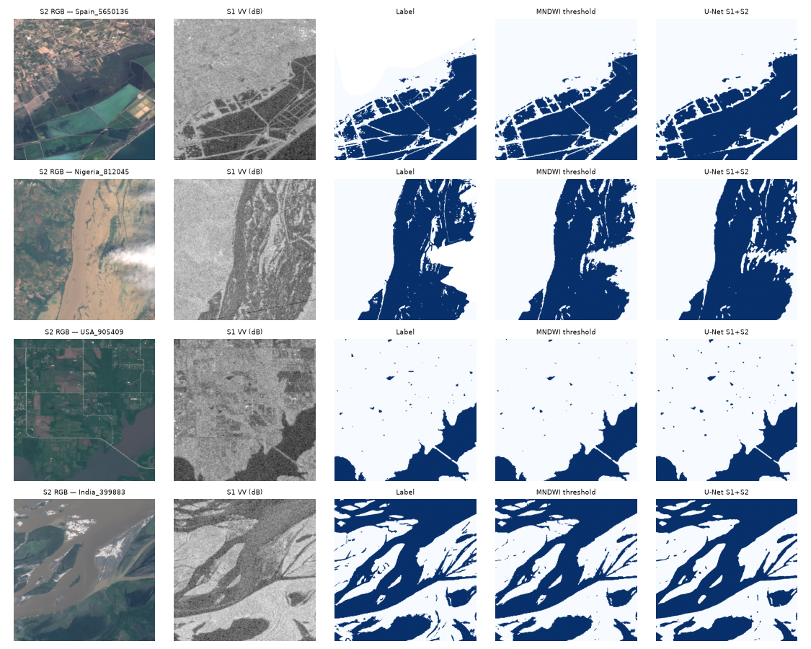
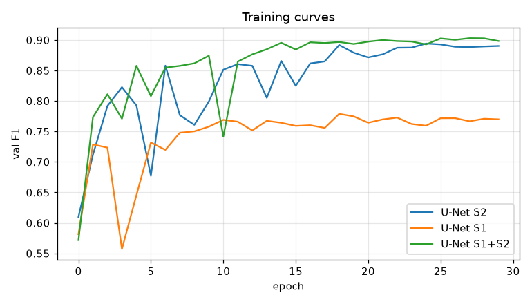
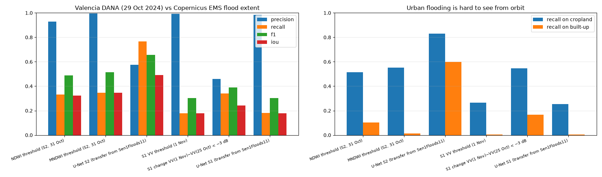
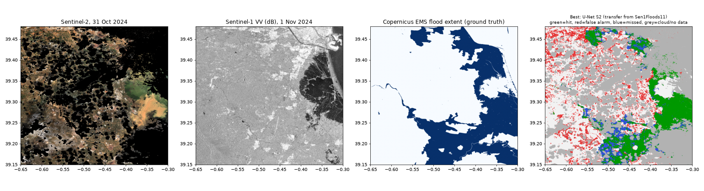
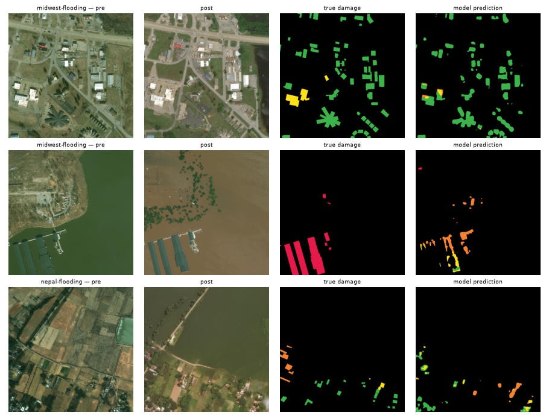

# Flood — Sen1Floods11 (11 countries), Valencia DANA 2024 and xBD

## Summary
- **Satellite (Sentinel-2 optical + Sentinel-1 radar, 10 m), 11 countries:** best model **U-Net S1+S2, IoU 0.82** (F1 0.90); even the untrained NDWI threshold reaches IoU 0.78. On the Bolivia event, never seen in training, U-Net S1+S2 gets IoU 0.79.
- **A recent large flood — Valencia, 29 October 2024:** against the official Copernicus EMS flood extent (≈324 km² in the study area) the best method is **U-Net S2 (transfer from Sen1Floods11): F1 0.66**. Index thresholds are very precise (precision ≈0.9+) but find only about a third of the flood.
- **Urban flooding is hard from orbit:** in Valencia, recall is 0.60 on built-up land and 0.83 on cropland.
- **Radar alone:** the Sentinel-1 pass two days later sees water already receding, recall 0.18; timing matters.
- **Building damage (xBD flood/hurricane events):** flood-driven building damage is among the hardest types — details below.

## Data and ground truth
| set | platform | resolution | ground truth |
|---|---|---|---|
| Sen1Floods11 (HF `blumenstiel/Sen1Floods11`) | satellite: Sentinel-1 GRD + Sentinel-2 L1C | 10 m | 446 hand-labelled 512×512 chips, 11 events |
| Valencia DANA, October 2024 | satellite: Sentinel-2 L2A (31 Oct), Sentinel-1 RTC (25 Oct, 1 Nov) — Planetary Computer | 10 m | Copernicus EMS EMSR773 AOI01 flood delineation |
| xBD: midwest-flooding, nepal-flooding, 4 hurricanes | satellite: Maxar | ~0.5 m | building damage levels |

## Results — Sen1Floods11 test (90 chips) and Bolivia (unseen event, 15 chips)
Thresholds were picked on the validation split (NDWI>-0.05, MNDWI>0.15, VV<-17 dB). "Flood only" excludes JRC permanent-water pixels.
| method | test IoU | test F1 | test flood-only IoU | Bolivia IoU | Bolivia F1 |
|---|---|---|---|---|---|
| NDWI | 0.776 | 0.874 | 0.688 | 0.816 | 0.898 |
| MNDWI | 0.773 | 0.872 | 0.687 | 0.703 | 0.825 |
| S1 VV threshold | 0.468 | 0.638 | 0.391 | 0.388 | 0.559 |
| U-Net S1 | 0.659 | 0.794 | 0.533 | 0.633 | 0.775 |
| U-Net S2 | 0.810 | 0.895 | 0.734 | 0.793 | 0.884 |
| U-Net S1+S2 | 0.818 | 0.900 | 0.742 | 0.791 | 0.883 |

*Method comparison*

*IoU per country/event*

*Random test chips*

*U-Net training curves*

## Case study — Valencia DANA (29 October 2024)
Models were transferred from Sen1Floods11 **without retraining** (the S2 model was trained on L1C and applied to L2A; band B10 was filled with its training mean). Permanent water (ESA WorldCover) is excluded.
| method | precision | recall | F1 | IoU | recall (built-up) | recall (cropland) |
|---|---|---|---|---|---|---|
| NDWI threshold (S2, 31 Oct) | 0.930 | 0.332 | 0.489 | 0.324 | 0.104 | 0.515 |
| MNDWI threshold (S2, 31 Oct) | 0.994 | 0.346 | 0.513 | 0.345 | 0.014 | 0.551 |
| U-Net S2 (transfer from Sen1Floods11) | 0.575 | 0.767 | 0.658 | 0.490 | 0.599 | 0.830 |
| S1 VV threshold (1 Nov) | 0.992 | 0.179 | 0.304 | 0.179 | 0.003 | 0.265 |
| S1 change VV(1 Nov)−VV(25 Oct) < −3 dB | 0.460 | 0.340 | 0.391 | 0.243 | 0.166 | 0.547 |
| U-Net S1 (transfer from Sen1Floods11) | 0.984 | 0.180 | 0.304 | 0.179 | 0.005 | 0.254 |

*Valencia: methods and recall by land cover*

*Valencia: imagery, EMS ground truth and the best prediction*

## Results — flood/hurricane building damage (xBD)
**Model:** 6-channel (pre + post RGB) U-Net / ResNet18, 5 classes (background, no damage, minor, major, destroyed). Trained on ≤250 images per event from xBD train + tier3 (3304 images), downsampled 1024 → 512 (~1 m/px), 12 epochs; best validation xView2 score 0.590. Test: xBD test split + a held-out 20 % of the tier3 events (1313 images). *Damage class F1* is the harmonic mean over the four damage classes (xView2 definition); *building* metrics use connected building components.

| event | buildings | building localisation F1 | damage class F1 | damaged/undamaged F1 (building) | destroyed recall | true damaged share |
|---|---|---|---|---|---|---|
| hurricane-florence | 1934 | 0.729 | 0.000 | 0.818 | 0.000 | 0.216 |
| hurricane-harvey | 6001 | 0.781 | 0.098 | 0.844 | 0.024 | 0.461 |
| hurricane-matthew | 2889 | 0.621 | 0.244 | 0.820 | 0.382 | 0.841 |
| hurricane-michael | 5305 | 0.722 | 0.249 | 0.533 | 0.076 | 0.352 |
| midwest-flooding | 2069 | 0.745 | 0.113 | 0.365 | 0.111 | 0.052 |
| nepal-flooding | 1642 | 0.741 | 0.023 | 0.616 | 0.000 | 0.256 |
| **flood (all)** | 3711 | 0.743 | 0.121 | 0.554 | 0.070 | 0.142 |
| **hurricane (all)** | 16129 | 0.744 | 0.394 | 0.734 | 0.259 | 0.464 |

*xBD flood events — random test tiles*

## Limitations
- The EMS ground truth was produced from the 30–31 October Landsat-8/Sentinel-2 images; methods using the same Sentinel-2 scene have an advantage, Sentinel-1 (1 Nov) a disadvantage (water had receded).
- The EMS "observed event" layer includes mud and flood traces that open-water indices cannot see, so part of the low recall is a definition gap.
- Sen1Floods11 chips are 10 m; narrow urban street flooding is invisible at that resolution.

## Sources
- Sen1Floods11 (Bonafilia et al., 2020): https://github.com/cloudtostreet/Sen1Floods11
- Copernicus EMS EMSR773: https://rapidmapping.emergency.copernicus.eu/EMSR773
- Sentinel-1/2, ESA WorldCover: Microsoft Planetary Computer
- xBD / xView2 (Gupta et al., 2019), Maxar Open Data imagery, CC BY-NC-SA 4.0 — HF mirror `hannan022/xview2-xbd`
