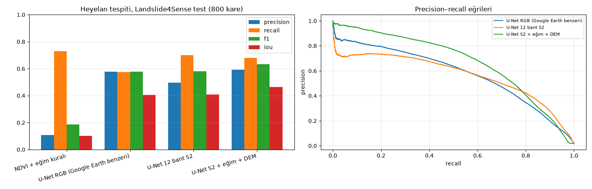
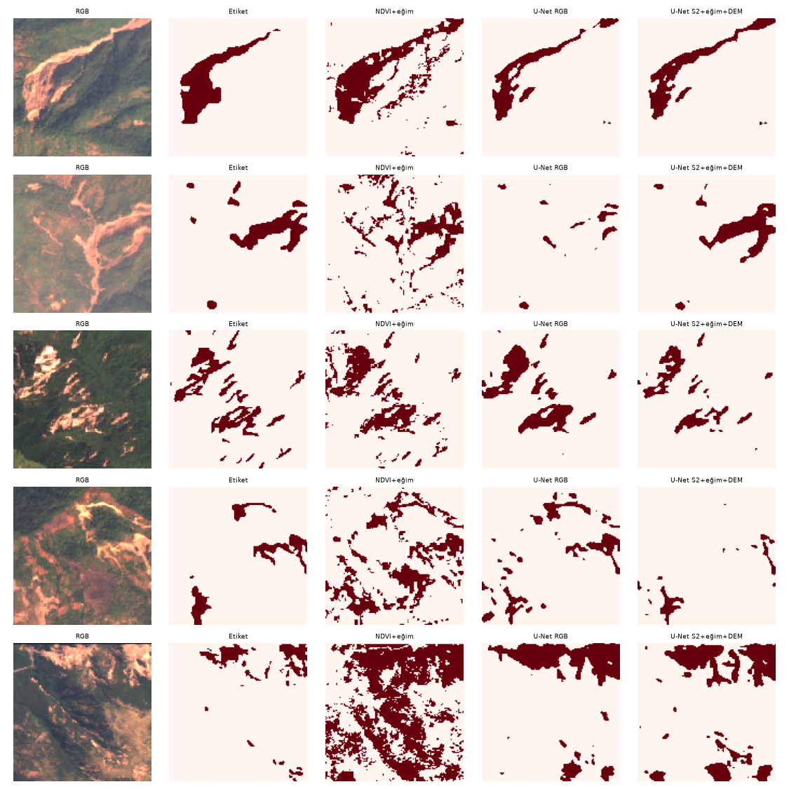
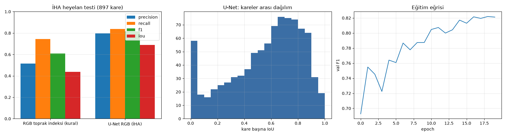
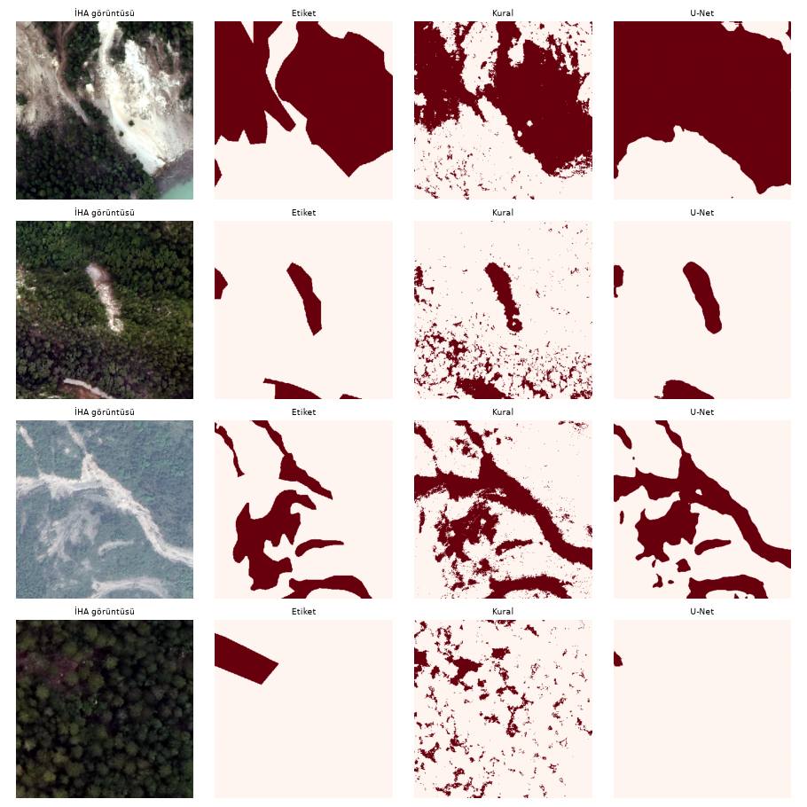

# Heyelan — Landslide4Sense (uydu) ve İHA heyelan seti (hava)

## Özet
- **Uydu (Sentinel-2 14 bant: 12 spektral + eğim + DEM, 10 m), Landslide4Sense test (800 kare):** en iyi **U-Net S2 + eğim + DEM: F1 0.63**, IoU 0.46. Sadece RGB (Google Earth benzeri bilgi) kullanan model F1 0.58 → çok bantlı + topografya katkısı ölçülebilir.
- **Kural tabanlı NDVI + eğim** F1 0.19: tek başına yetersiz.
- **Hava (İHA, RGB, cm–dm çözünürlük), 897 test karesi:** **U-Net RGB (İHA): F1 0.82**, IoU 0.69; RGB toprak indeksi kuralı F1 0.61.
- Heyelan pikselleri azınlıkta (uyduda 1.9%, İHA'da 19.1%) — precision/recall dengesi eşiğe çok duyarlı.

## Veri ve yer gerçeği
| set | platform | çözünürlük | yer gerçeği |
|---|---|---|---|
| Landslide4Sense (HF `ibm-nasa-geospatial/Landslide4sense`) | uydu: Sentinel-2 + ALOS PALSAR eğim/DEM | ~10 m, 128×128 | piksel maskesi; 3799/245/800 train/val/test |
| İHA heyelan seti (HF `syeddhasnainn/landslide-uav-all`, alt küme) | hava: İHA RGB | cm–dm (384×384'e küçültüldü) | piksel maskesi; 1812/431/897 kullanıldı |

## Sonuçlar — uydu (Landslide4Sense)
Kural eşiği doğrulamada seçildi: NDVI < -0.20 ve eğim > 0.99 (normalize).
| yöntem | precision | recall | F1 | IoU |
|---|---|---|---|---|
| NDVI + eğim kuralı | 0.107 | 0.731 | 0.187 | 0.103 |
| U-Net RGB (Google Earth benzeri) | 0.579 | 0.575 | 0.577 | 0.405 |
| U-Net 12 bant S2 | 0.497 | 0.700 | 0.581 | 0.410 |
| U-Net S2 + eğim + DEM | 0.592 | 0.680 | 0.632 | 0.463 |

*Landslide4Sense: metrikler ve precision–recall eğrileri*

*Rastgele test kareleri (RGB, etiket, kural, U-Net RGB, U-Net çok bantlı)*

## Sonuçlar — hava (İHA)
| yöntem | precision | recall | F1 | IoU |
|---|---|---|---|---|
| RGB toprak indeksi (kural) | 0.516 | 0.745 | 0.610 | 0.439 |
| U-Net RGB (İHA) | 0.795 | 0.838 | 0.816 | 0.689 |

*İHA heyelan: metrikler, kare başına IoU dağılımı, eğitim eğrisi*

*Rastgele İHA test kareleri*

## Sınırlar
- İHA setinin yalnızca bir alt kümesi kullanıldı (19 eğitim parçasından 4'ü); görüntüler 384 px'e küçültüldü.
- Landslide4Sense test bölgeleri eğitimle benzer coğrafyalardan; yeni bir bölgeye (örn. 6 Şubat'ın tetiklediği heyelanlar) aktarım ayrıca test edilmeli.

## Kaynaklar
- Landslide4Sense (Ghorbanzadeh ve ark., 2022): https://github.com/iarai/Landslide4Sense-2022
- İHA heyelan seti: https://huggingface.co/datasets/syeddhasnainn/landslide-uav-all
