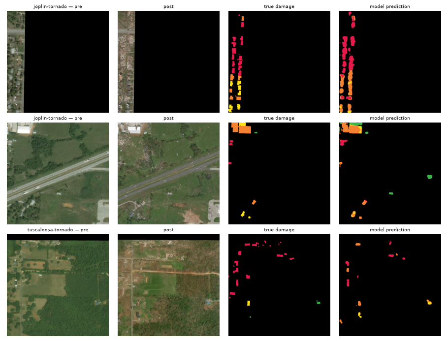
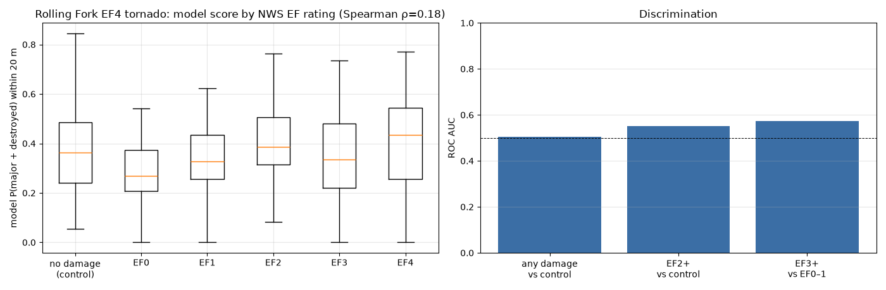
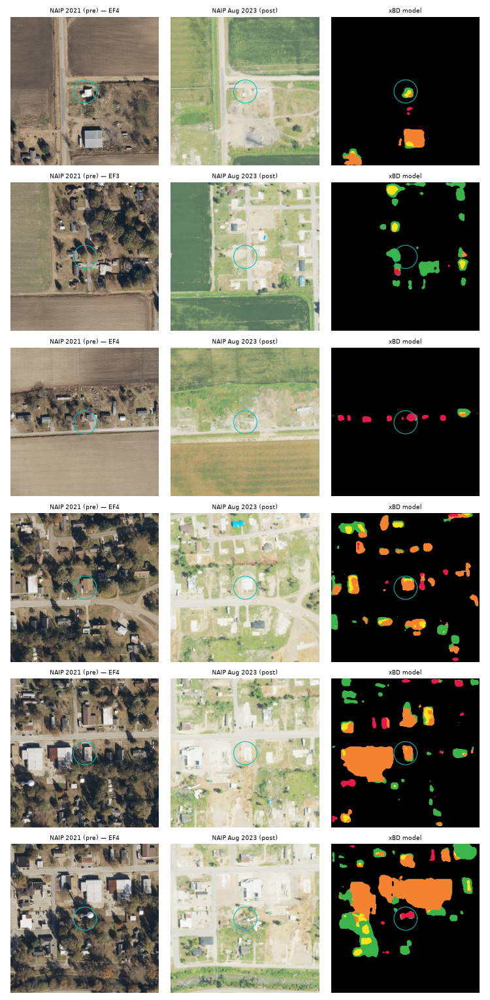

# Tornado — xBD (Joplin, Moore, Tuscaloosa) and Rolling Fork 2023 (aerial photography)

## Summary
- **Satellite (Maxar, xBD), 3 tornado events:** building localisation F1 0.79, damaged/undamaged building F1 **0.76**, destroyed-building recall 0.69.
- **Aerial photography (NAIP aircraft imagery, 2021 pre / August 2023 post), Rolling Fork EF4 tornado (24 March 2023):** the xBD satellite model was applied without any training and barely transfers. Against 341 NWS survey points on structures: **EF3+ vs EF0–1 AUC 0.57**, EF2+ vs undamaged control buildings AUC 0.55, any damage vs control AUC 0.50; Spearman ρ=0.18 between EF rating and model score. Undamaged control buildings score as high as damaged ones (mean 0.38 vs 0.29–0.42 for EF0–EF4), so seasonal change between the November and August flights is read as damage.

## Data and ground truth
| set | platform | resolution | ground truth |
|---|---|---|---|
| xBD tier3: joplin, moore, tuscaloosa | satellite: Maxar | ~0.5 m (~1 m in the model) | building damage levels |
| NAIP Mississippi 2021-11 and 2023-08 (Planetary Computer) | aerial: aircraft (USDA NAIP) | 0.3 m / 0.6 m → resampled to 1 m | NOAA NWS Damage Assessment Toolkit: EF-rated structure points |

## Results — xBD tornado events
**Model:** 6-channel (pre + post RGB) U-Net / ResNet18, 5 classes (background, no damage, minor, major, destroyed). Trained on ≤250 images per event from xBD train + tier3 (3304 images), downsampled 1024 → 512 (~1 m/px), 12 epochs; best validation xView2 score 0.590. Test: xBD test split + a held-out 20 % of the tier3 events (1313 images). *Damage class F1* is the harmonic mean over the four damage classes (xView2 definition); *building* metrics use connected building components.

| event | buildings | building localisation F1 | damage class F1 | damaged/undamaged F1 (building) | destroyed recall | true damaged share |
|---|---|---|---|---|---|---|
| joplin-tornado | 2288 | 0.789 | 0.591 | 0.753 | 0.712 | 0.267 |
| moore-tornado | 3915 | 0.807 | 0.441 | 0.776 | 0.802 | 0.146 |
| tuscaloosa-tornado | 1934 | 0.743 | 0.551 | 0.759 | 0.489 | 0.311 |
| **tornado (all)** | 8137 | 0.788 | 0.575 | 0.762 | 0.695 | 0.219 |

*xBD tornado events — random test tiles*

## Case study — Rolling Fork, Mississippi (EF4, 24 March 2023), aerial photography
For each NWS damage point a 256 m × 256 m pre/post NAIP chip was cut; score = the model's *major + destroyed* probability within 20 m of the point (weighted by building pixels). Controls: random built-up points (ESA WorldCover) more than 1.5 km from any damage point where the model finds a building (93 points).
| level | points | mean score |
|---|---|---|
| none | 93 | 0.376 |
| EF0 | 21 | 0.286 |
| EF1 | 130 | 0.342 |
| EF2 | 118 | 0.423 |
| EF3 | 45 | 0.364 |
| EF4 | 27 | 0.396 |

*Rolling Fork: model score by EF rating and AUC*

*Random NAIP chips (cyan circle = 20 m scoring radius)*

## Limitations
- The NAIP post image was flown ~4.5 months after the event: debris was cleared and some structures repaired, so damage looks smaller.
- NAIP (aircraft, nadir) and Maxar (satellite, oblique) differ in colour and scale; the model never saw aerial imagery.
- NWS points are damaged structures only; the "undamaged" class is approximated with control points.
- **Observed failure mode:** at EF4 points the debris had been removed by August 2023; the model reads the empty lot as "no building" and the damage score stays low (first and third rows of the sample figure). In xBD destroyed buildings always appear as rubble, so the model never learned "missing building" as damage. Scoring at the building location found in the pre image would reduce this.

## Sources
- xBD / xView2 (Gupta et al., 2019), Maxar Open Data imagery, CC BY-NC-SA 4.0 — HF mirror `hannan022/xview2-xbd`
- NAIP: Microsoft Planetary Computer `naip`
- NWS Damage Assessment Toolkit: https://apps.dat.noaa.gov/stormdamage/damageviewer/
