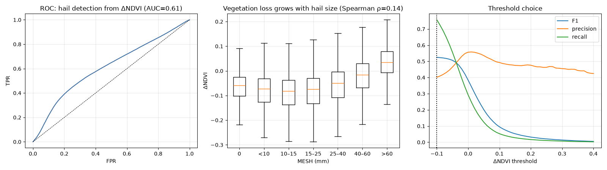
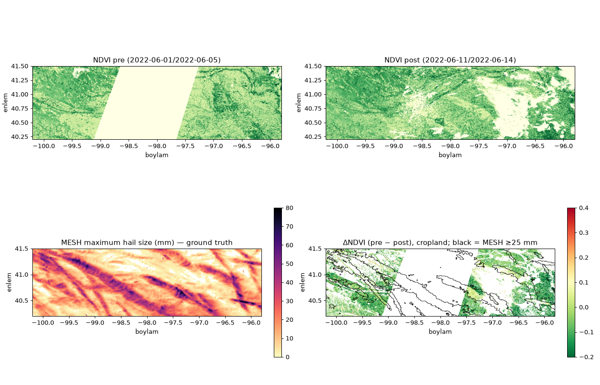
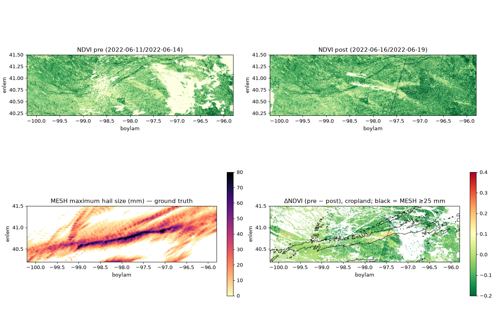

# Hail — Nebraska/Iowa, June 2022 (Sentinel-2 vs radar MESH)

## Summary
- Hail itself is not visible; the satellite only sees **damage to vegetation** (an NDVI drop). Ground truth is NOAA MRMS **MESH** (radar-estimated maximum hail size, ~1 km); its location was checked against SPC hail reports (median MESH at the reports ~36 mm).
- **Small/moderate hail (≥25 mm) is barely separable:** AUC 0.51–0.61.
- **Large hail is visible:** up to AUC **0.84** for ≥60 mm; ΔNDVI rises steadily with hail size.
- The result is very sensitive to the date window: crops grow fast in June, so the longer the gap between pre and post, the weaker the signal.

## Data and ground truth
| data | platform | resolution |
|---|---|---|
| Sentinel-2 L2A (B04, B08, SCL cloud mask) — Planetary Computer | satellite | 10 m → averaged to 0.0025° (~250 m) cells |
| ESA WorldCover 2021 (cropland mask) | satellite product | 10 m |
| NOAA MRMS MESH_Max_1440min (IEM archive) | ground radar | 0.01° (~1 km) |
| NOAA SPC hail reports | observers | points |

## Results
Positive: MESH ≥ 25 mm; negative: MESH < 10 mm over the same period. Score: ΔNDVI = NDVI(pre) − NDVI(post), cropland cells only.
| configuration | valid cells | hail cells | AUC ≥25 mm | AUC ≥40 mm | AUC ≥60 mm | Spearman (MESH, ΔNDVI) | best F1* |
|---|---|---|---|---|---|---|---|
| A: single event (14 Jun), pre 11–14 / post 16–19 Jun | 467573 | 71535 | 0.512 | 0.597 | 0.704 | 0.111 | 0.415 |
| C: events 6–14 Jun, pre 1–5 / post 11–14 Jun | 283310 | 65626 | 0.612 | 0.715 | 0.836 | 0.135 | 0.525 |
| B: events 6–19 Jun, pre 1–5 / post 16–19 Jun | 374634 | 142313 | 0.526 | 0.626 | 0.783 | 0.126 | 0.576 |

\* The F1 threshold was picked on the same data (optimistic); the threshold-free AUC is the real comparison.

*Configuration C: ROC, ΔNDVI by MESH class, threshold curves*

*Configuration C: NDVI pre/post, MESH and ΔNDVI maps*

*Configuration A: the 14 June event*

## Limitations
- MESH is a radar estimate (it often overestimates hail size and does not measure hail at the ground) — the best available area measurement, not truth.
- ~250 m cells mix field boundaries; field-level analysis and a longer time series would strengthen the signal.
- In early June corn and soy are small, so damage shows little in NDVI; July–August events may be clearer.

## Sources
- NOAA MRMS (IEM archive): https://mtarchive.geol.iastate.edu/
- NOAA SPC Storm Reports: https://www.spc.noaa.gov/climo/reports/
- CIMSS satellite blog, Nebraska/Iowa hail swaths (June 2022): https://cimss.ssec.wisc.edu/satellite-blog/archives/46975
