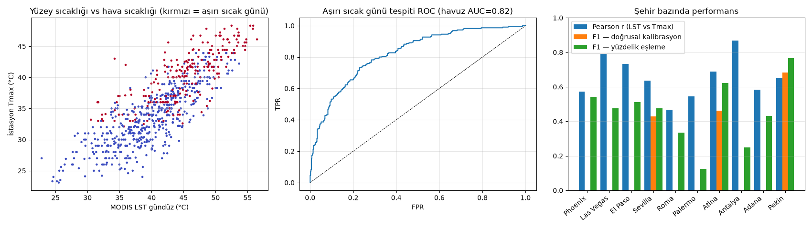
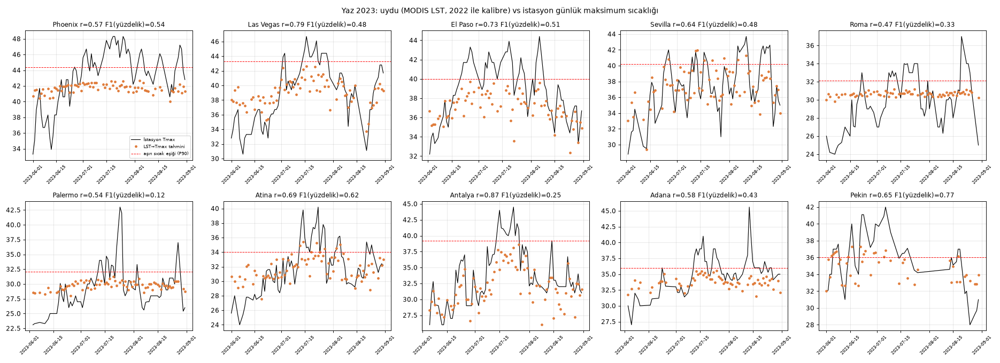
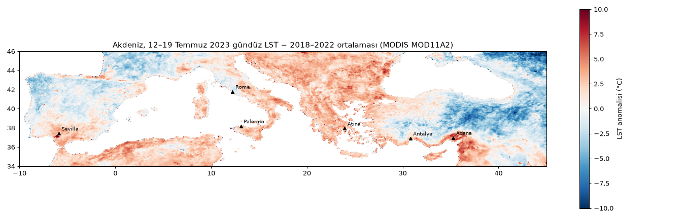

# Aşırı sıcak — Yaz 2023 sıcak hava dalgaları (MODIS yüzey sıcaklığı vs istasyon)

## Özet
- **10 şehir** (Phoenix, Las Vegas, El Paso, Sevilla, Roma, Palermo, Atina, Antalya, Adana, Pekin), Haziran–Ağustos 2023; kalibrasyon yalnızca 2022 yazıyla.
- Uydu gündüz yüzey sıcaklığı (LST) ile istasyon günlük maksimum hava sıcaklığı ortalama **r = 0.65**; doğrusal kalibrasyon hatası ortalama **3.0 °C** RMSE.
- **Aşırı sıcak günü tespiti** (istasyon Tmax ≥ 2013–2022 yaz P90): sıralama gücü iyi (**havuz AUC 0.82**), fakat eşikleme yöntemi belirleyici: doğrusal kalibrasyon F1 0.20 (tahminler ortalamaya çekiliyor), yüzdelik eşleme F1 **0.50** (precision 0.70, recall 0.40).
- Akdeniz LST anomali haritası Temmuz 2023 "Cerberus" dalgasını Sicilya, Sardunya, Yunanistan, Kuzey Afrika ve Adana çevresinde net gösteriyor (kara ortalaması +0.4 °C).

## Veri ve yer gerçeği
| veri | platform | çözünürlük |
|---|---|---|
| MODIS Terra MOD11A1 günlük LST (gündüz) — Planetary Computer | uydu | 1 km |
| MODIS Terra MOD11A2 8 günlük LST (anomali haritası) | uydu | 1 km → 0,05° |
| Meteostat (NOAA ISD/DWD istasyonları) günlük Tmax, 2013–2023 | yer istasyonu | nokta |

## Sonuçlar — şehir bazında (test yılı 2023)
| şehir | istasyon | gün (bulutsuz) | aşırı sıcak gün | r | RMSE °C | AUC | F1 doğrusal | F1 yüzdelik |
|---|---|---|---|---|---|---|---|---|
| Phoenix | Phoenix Sky Harbor Airport | 77 | 34 | 0.573 | 3.694 | 0.814 | 0.000 | 0.542 |
| Las Vegas | McCarran International Airport | 78 | 16 | 0.790 | 2.834 | 0.893 | 0.000 | 0.476 |
| El Paso | El Paso International Airport | 75 | 32 | 0.733 | 2.884 | 0.884 | 0.000 | 0.512 |
| Sevilla | Sevilla / San Pablo | 78 | 20 | 0.637 | 2.618 | 0.771 | 0.429 | 0.476 |
| Roma | Roma Fiumicino | 72 | 21 | 0.468 | 2.995 | 0.653 | 0.000 | 0.333 |
| Palermo | Palermo / Punta Raisi | 75 | 12 | 0.544 | 3.377 | 0.753 | 0.000 | 0.125 |
| Atina | El Venizelos / Liádha | 81 | 20 | 0.689 | 2.587 | 0.892 | 0.462 | 0.622 |
| Antalya | Antalya | 82 | 14 | 0.868 | 3.105 | 0.963 | 0.000 | 0.250 |
| Adana | Adana / Sakirpasa | 66 | 27 | 0.585 | 2.890 | 0.800 | 0.000 | 0.432 |
| Pekin | Beijing | 46 | 24 | 0.651 | 2.777 | 0.854 | 0.684 | 0.766 |

*LST–Tmax ilişkisi, aşırı sıcak günü ROC ve şehir bazında performans*

*Yaz 2023 zaman serileri: istasyon Tmax ve uydu tahmini*

*12–19 Temmuz 2023 LST anomalisi (2018–2022 ortalamasına göre)*

## Sınırlar
- LST yüzey sıcaklığıdır, hava sıcaklığı değil; kentsel yüzeyler/çıplak toprak gündüz 10–20 °C daha sıcak olabilir.
- Bulutlu günlerde ölçüm yok (gün sayısı sütunu); Pekin'de muson nedeniyle yaz günlerinin ~yarısı kayıp.
- 2023, 2022'den belirgin sıcaktı: 2022 oranıyla kalibre edilen eşikler 2023'teki aşırı gün sayısını eksik tahmin ediyor (recall düşük).

## Kaynaklar
- MODIS LST (Wan ve ark.), Microsoft Planetary Computer `modis-11A1-061`, `modis-11A2-061`
- Meteostat: https://meteostat.net
