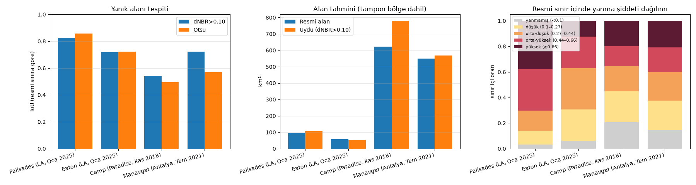
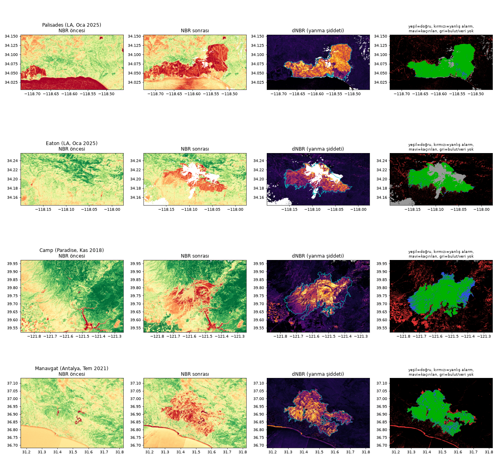
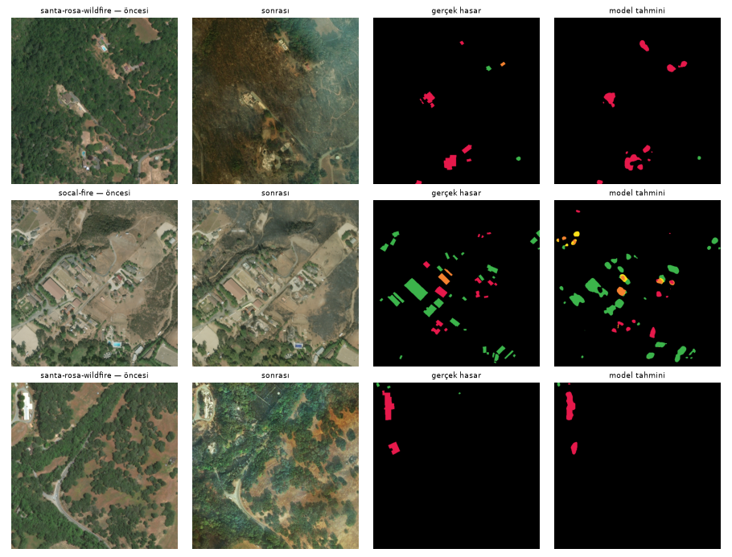

# Yangın — yanık alanı (Sentinel-2 dNBR) ve bina hasarı (xBD)

## Özet
- **Yanık alanı, 4 yangın, resmi sınırlara karşı:** Palisades IoU 0.86, Eaton IoU 0.72, Camp IoU 0.54, Manavgat IoU 0.72 (en iyi eşik).
- Tek bir standart eşik (USGS dNBR > 0,10) eğitim olmadan çoğu yangında iyi çalışıyor; hatalar resmi sınır içindeki yanmamış adacıklar, hasat edilen tarlalar ve bulut kaynaklı.
- **Yangın kaynaklı bina hasarı (xBD, 5 yangın olayı):** hasarlı/hasarsız bina F1 **0.79**, yıkılmış bina recall 0.75 — yangın, xBD'de en iyi tespit edilen afet türlerinden (yanmış binalar ikili: ya ayakta ya kül).

## Veri ve yer gerçeği
| veri | platform | çözünürlük | yer gerçeği |
|---|---|---|---|
| Sentinel-2 L2A B08/B12 öncesi–sonrası mozaik — Planetary Computer | uydu | 20 m (~25 m grid) | NIFC WFIGS / InterAgency yangın sınırları (ABD), EFFIS yanık alanı (Manavgat) |
| xBD: socal, santa-rosa, woolsey, portugal, pinery | uydu: Maxar | ~0,5 m (modelde ~1 m) | bina hasar seviyeleri |

## Sonuçlar — yanık alanı
| yangın | yöntem | precision | recall | F1 | IoU | resmi alan km² | uydu alanı km²** |
|---|---|---|---|---|---|---|---|
| Palisades (LA, Oca 2025) | dNBR>0.10 (USGS düşük şiddet) | 0.849 | 0.967 | 0.904 | 0.825 | 96.352 | 106.656 |
| Palisades (LA, Oca 2025) | dNBR>0.27 (USGS orta-düşük) | 0.987 | 0.860 | 0.919 | 0.851 | 96.352 | 81.654 |
| Palisades (LA, Oca 2025) | Otsu (0.26) | 0.986 | 0.867 | 0.922 | 0.856 | 96.352 | 82.379 |
| Eaton (LA, Oca 2025) | dNBR>0.10 (USGS düşük şiddet) | 0.755 | 0.939 | 0.837 | 0.720 | 56.882 | 52.229 |
| Eaton (LA, Oca 2025) | dNBR>0.27 (USGS orta-düşük) | 0.974 | 0.694 | 0.810 | 0.681 | 56.882 | 29.913 |
| Eaton (LA, Oca 2025) | Otsu (0.24) | 0.964 | 0.743 | 0.839 | 0.723 | 56.882 | 32.352 |
| Camp (Paradise, Kas 2018) | dNBR>0.10 (USGS düşük şiddet) | 0.631 | 0.792 | 0.702 | 0.541 | 621.322 | 780.138 |
| Camp (Paradise, Kas 2018) | dNBR>0.27 (USGS orta-düşük) | 0.833 | 0.551 | 0.663 | 0.496 | 621.322 | 410.582 |
| Camp (Paradise, Kas 2018) | Otsu (0.27) | 0.834 | 0.549 | 0.662 | 0.495 | 621.322 | 408.195 |
| Manavgat (Antalya, Tem 2021) | dNBR>0.10 (USGS düşük şiddet) | 0.824 | 0.853 | 0.839 | 0.722 | 548.800 | 568.184 |
| Manavgat (Antalya, Tem 2021) | dNBR>0.27 (USGS orta-düşük) | 0.909 | 0.625 | 0.741 | 0.589 | 548.800 | 377.419 |
| Manavgat (Antalya, Tem 2021) | Otsu (0.28) | 0.913 | 0.603 | 0.726 | 0.570 | 548.800 | 362.524 |

\*\* Uydu alanı, sınırın %25 tamponlu kutusunun tamamında ölçüldü (kutudaki başka yanıklar da sayılır).

*IoU, alan karşılaştırması, sınır içi yanma şiddeti dağılımı*

*NBR öncesi/sonrası, dNBR ve hata haritası*

## Sonuçlar — bina hasarı (xBD yangın olayları)
**Model:** 6 kanallı (öncesi+sonrası RGB) U-Net/ResNet18, 5 sınıf (arka plan, hasarsız, az, ağır, yıkılmış). xBD train+tier3'ten olay başına ≤250 görüntü (3304 görüntü), 1024→512 küçültülerek (~1 m/px) 12 epoch eğitildi; en iyi doğrulama xView2 skoru 0.628. Test: xBD test bölümü + tier3 olaylarının ayrılmış %20'si (1313 görüntü). *Hasar sınıf F1* = 4 hasar sınıfının harmonik ortalaması (xView2 tanımı); *bina* metrikleri bağlantılı bina bileşenleri üzerinden.

| olay | bina | bina bulma F1 | hasar sınıf F1 | hasarlı/hasarsız F1 (bina) | yıkılmış recall | gerçek hasarlı payı |
|---|---|---|---|---|---|---|
| pinery-bushfire | 335 | 0.722 | 0.000 | 0.205 | 0.167 | 0.104 |
| portugal-wildfire | 829 | 0.706 | 0.000 | 0.289 | 0.194 | 0.057 |
| santa-rosa-wildfire | 3833 | 0.753 | 0.001 | 0.922 | 0.924 | 0.247 |
| socal-fire | 3575 | 0.695 | 0.082 | 0.603 | 0.488 | 0.131 |
| woolsey-fire | 743 | 0.652 | 0.000 | 0.702 | 0.598 | 0.289 |
| **fire (toplam)** | 9315 | 0.718 | 0.044 | 0.791 | 0.746 | 0.184 |

*xBD yangın olayları — rastgele test kareleri*

## Sınırlar
- Resmi sınırlar yanmamış adacıkları da kapsar; IoU üst sınırı 1'in altındadır.
- EFFIS sınırı MODIS/VIIRS + Sentinel-2 tabanlı, NIFC sınırları hava/saha ölçümlü — kaynaklar arası tutarlılık farklı.
- Camp yangınında "sonrası" Aralık mozaiğinde bulut/kar ve hasat edilmiş tarlalar yanlış alarm üretiyor.

## Kaynaklar
- NIFC WFIGS Interagency Perimeters: https://data-nifc.opendata.arcgis.com
- EFFIS: https://effis.jrc.ec.europa.eu
- xBD / xView2 (Gupta ve ark., 2019), Maxar Open Data görüntüleri, CC BY-NC-SA 4.0 — HF mirror `hannan022/xview2-xbd`
